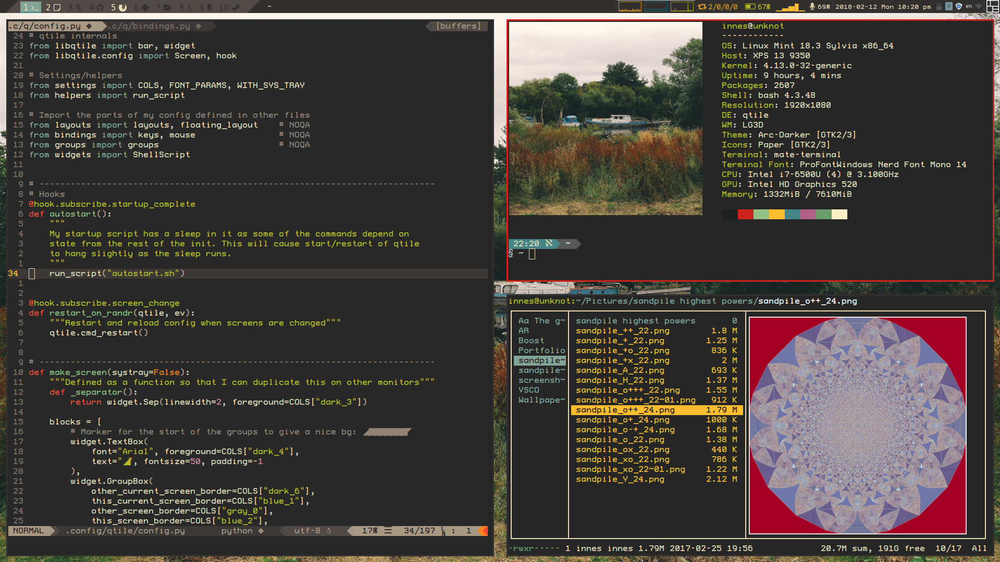
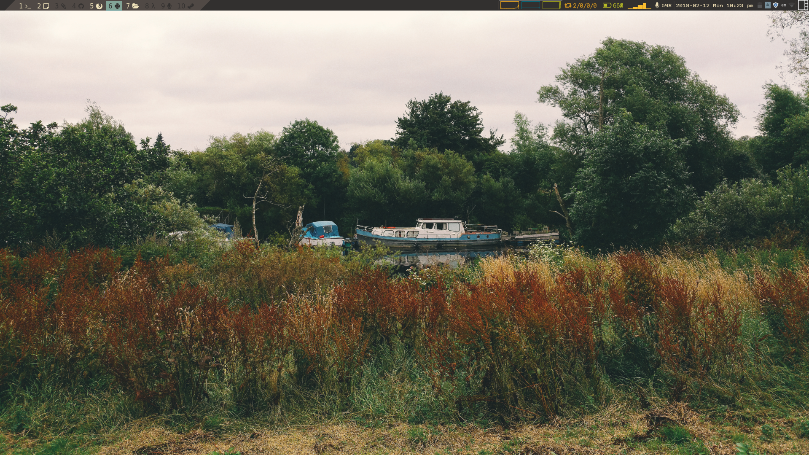

My qtile config
===============




# Setting up qtile
qtile docs can be found [here](0)

Info on running qtile as the wm for Gnome can be found [here](1). It should be
possible to do something similar with mate...


### Installing qtile
```bash
$ sudo apt-get install libpangocairo-1.0-0 libxcb-render0-dev libffi-dev
$ sudo python3 -m pip install xcffib cairocfii qtile
```

### Adding qtile to the desktop list
```bash
$ cp misc/qtile.desktop /usr/share/xsessions/
```


  [0]: http://docs.qtile.org/en/latest/
  [1]: http://docs.qtile.org/en/latest/manual/config/gnome.html
